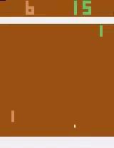
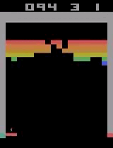
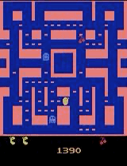

# AI_Gamer
Bachelor project: Deep Reinforcement Learning-based AI algorithms for Atari games

# AI in action 

# Training notebook
You can find the main training notebook for DQN here "[here](https://github.com/Omarraita/AI_Gamer/blob/main/DQN/From%20pixels/Atari/AtariDQNTrain.ipynb)". This notebook can be used to train an agent on various games such as pong, breakout and pacman. 

A "[pretrained model](https://github.com/Omarraita/AI_Gamer/tree/main/DQN/From%20pixels/Atari/trainedmodels)" for pong is also available.

# Requirements
Install the version 1.2.1 of atari-py: 
'''
pip install --no-index -f https://github.com/Kojoley/atari-py/releases atari_py
'''

# Project presentation

# Report
The project's report AI-Gamer.pdf contains a detailed explanation of the algorithms as well as the implementation choices.
